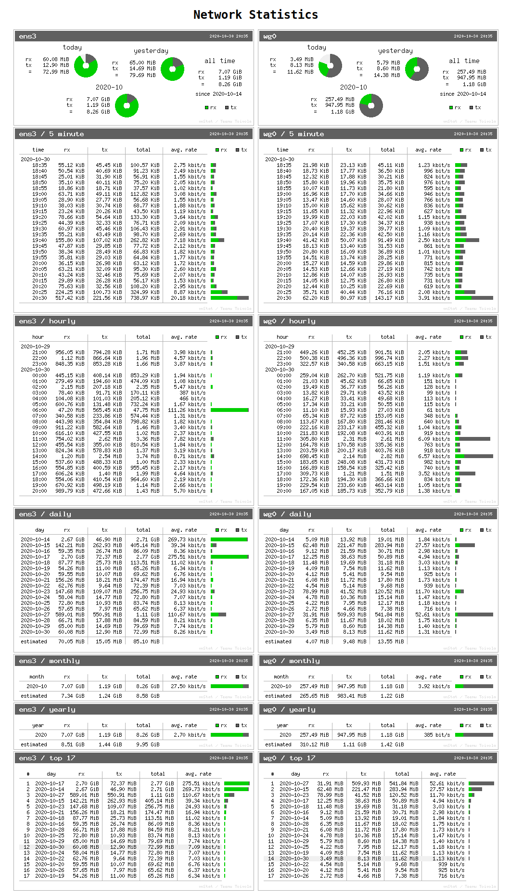
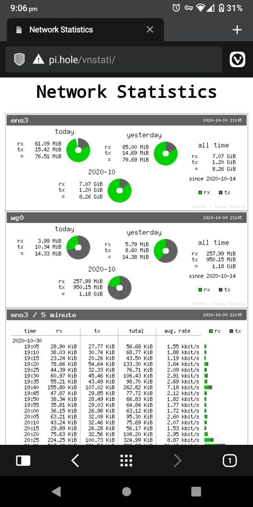

# vnstati

`vnstat` is a small tool to monitor and report network usage of a linux system. `vnstati` is a supportive tool for vnstat to generate the network statistics as png files.

This repository contains [a small script](vnstati.sh) to generate `vnstati` images and [index.html](index.html) to display the images as a webpage.

## Dependencies

make sure vnstat and vnstati are installed and configured.

to install:
```
sudo apt install vnstat vnstati
```

to configure:  
go to `/etc/vnstat.conf` in your server and make sure the `Interface: ` is set to blank or updated with right name.

## How to use this repo?

- go to `/var/www/html/` in your system / server
- clone the repo in by running

    ```
    git clone https://github.com/anbuchelva/vnstati.git
    ```

    in the same path. Make sure you are having root previliges.
- Modify the [vnstati.sh](vnstati.sh) according to the network interface name (this can be identified by running `ip a`in terminal)
- Update cron job to generate these images in specific interval. run `
sudo crontab -e` and add the following line at the end of the file `*/5 * * * * /var/www/html/vnstati/vnstati.sh`. This would generate the images for every 5 minutes.

There are two interfaces listed in the script and the html file, which can be modified based on your need.

visit `http://localhost/vnstat` or `http://<server-ip>/vnstat` to view the page.  Sample screenshots are provided here.

## Screenshots
### pc browser:

### mobile browser:
